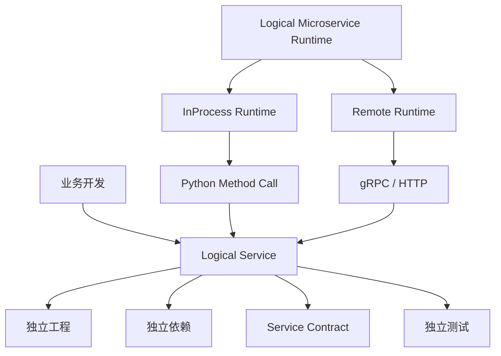
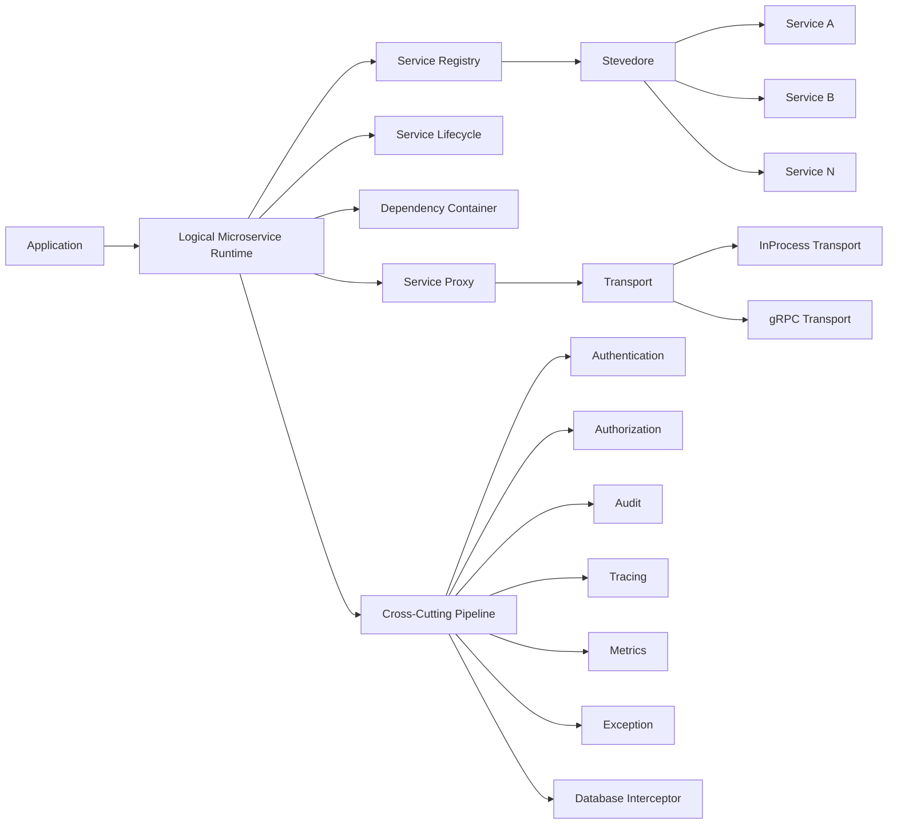
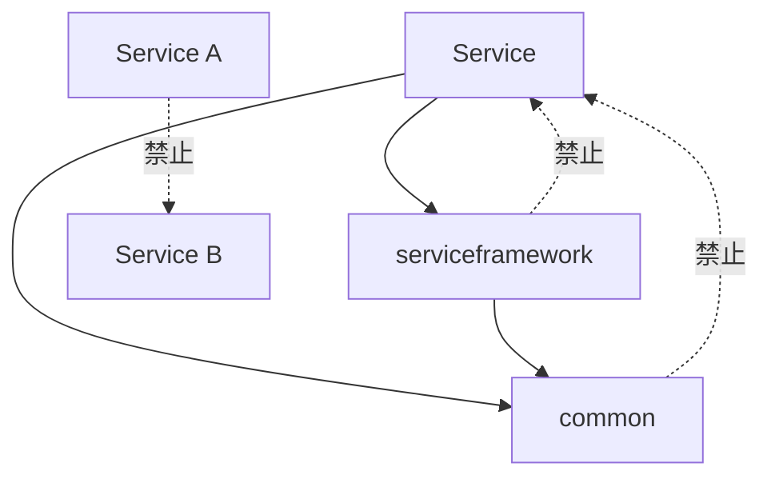
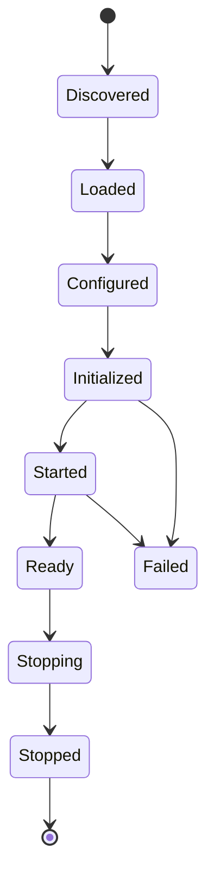
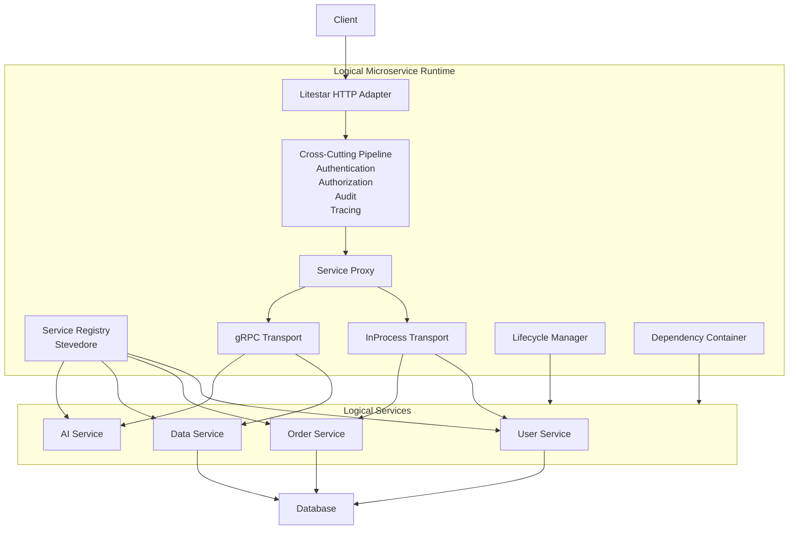

# Python Logical Microservice Runtime 技术选型与架构设计说明书

版本：V1.0  
适用范围：Python 后端服务开发  
目标架构：Logical Microservice + InProcess/Remote 可切换运行时  
技术基线：Python 3.12+

## 1. 建设目标

本项目不采用“每个微服务必须独立进程、独立容器”的传统微服务模式，而采用 Logical Microservice（逻辑微服务）架构。

逻辑微服务要求在代码组织、依赖关系、接口契约、生命周期、测试和业务边界上保持完全独立；但在实际部署时，由 Runtime 根据运行环境、流量、资源消耗和运维要求，决定 Service 采用 InProcess、独立 Process 或 Remote Service 的方式运行。

因此，开发模型与部署模型必须解耦。



核心目标：

1. Service 按独立微服务方式开发。
2. Service 可以独立声明依赖。
3. Service 不直接依赖具体部署方式。
4. Service 可以在同一个 Python Process 内运行。
5. Service 可以无业务代码修改地拆分为独立 Process。
6. Service 可以进一步部署到独立容器、节点甚至集群。
7. Service-to-Service 调用具有 Location Transparency。
8. 登录认证、授权、审计、Tracing、数据库拦截等横切能力由 Runtime 统一处理。
9. 业务 Service 尽可能只保留业务逻辑。
10. Framework 与业务 Service 保持单向依赖，避免形成大型 Python 单体工程。

---

# 2. 总体技术选型

| 层次 | 技术 | 定位 |
|---|---|---|
| Python Runtime | Python 3.12+ | 基础运行环境 |
| Web/API Framework | Litestar | HTTP/API Adapter |
| Service Discovery | Stevedore | Service 自动发现、加载 |
| Service Contract | Python Protocol / ABC + Pydantic | Service 接口契约 |
| Configuration | Pydantic Settings | 配置模型与校验 |
| ORM / Database | SQLAlchemy 2.x | 数据访问 |
| Remote RPC | gRPC | Remote Service 通信 |
| Serialization | Protobuf / Pydantic | RPC/API 数据契约 |
| Observability | OpenTelemetry | Trace / Metrics / Logs |
| Runtime | 自研 Logical Microservice Runtime | 核心平台 |
| InProcess Transport | 自研 | 本地 Service 调用 |
| Remote Transport | 自研 + gRPC | 跨进程 Service 调用 |
| HTTP Middleware | Litestar Middleware | HTTP 横切能力 |
| RPC Interceptor | gRPC Interceptor | RPC 横切能力 |
| Database Interceptor | SQLAlchemy Event / Engine/Session Hook | DB 横切能力 |
| Packaging | pyproject.toml | Service 独立工程 |
| Dependency Management | uv / pip | Python 依赖管理 |
| ASGI Server | Uvicorn | Litestar 运行 |

Litestar本身提供 Plugin、DI、Security、Middleware、OpenAPI 等能力，并支持 SQLAlchemy Plugin；这些能力用于构建 Runtime 的 Web Adapter，而不是把 Litestar直接定义为整个微服务框架。

Stevedore基于 Python Entry Points 提供动态扩展发现和加载能力，适合作为 Service Registry 的 Discovery 实现。

---

# 3. 核心架构思想

系统采用五个核心抽象：

```text
Service
Service Contract
Service Registry
Service Proxy
Transport
```

整体关系：



业务 Service 不应该知道：

```text
Service B 是不是本进程
Service B 在哪个 IP
Service B 使用什么端口
Service B 是不是 Kubernetes Deployment
Service B 使用 HTTP 还是 gRPC
```

业务只依赖 Service Contract。

---

# 4. 工程目录结构

推荐采用 Monorepo + Multi-Package 结构。

```text
backend/
│
├── pyproject.toml
├── README.md
│
├── framework/
│   ├── pyproject.toml
│   └── src/
│       └── serviceframework/
│           │
│           ├── contract/
│           │   ├── service.py
│           │   ├── request.py
│           │   ├── response.py
│           │   └── errors.py
│           │
│           ├── runtime/
│           │   ├── runtime.py
│           │   ├── context.py
│           │   └── lifecycle.py
│           │
│           ├── registry/
│           │   ├── registry.py
│           │   └── stevedore_registry.py
│           │
│           ├── proxy/
│           │   ├── proxy.py
│           │   └── factory.py
│           │
│           ├── transport/
│           │   ├── base.py
│           │   ├── local.py
│           │   └── grpc.py
│           │
│           ├── middleware/
│           │   ├── authentication.py
│           │   ├── authorization.py
│           │   ├── audit.py
│           │   └── tracing.py
│           │
│           ├── interceptors/
│           │   ├── service.py
│           │   ├── grpc.py
│           │   └── database.py
│           │
│           ├── web/
│           │   ├── application.py
│           │   └── router.py
│           │
│           ├── config/
│           ├── observability/
│           └── exceptions/
│
├── common/
│   ├── pyproject.toml
│   └── src/
│       └── common/
│           ├── database/
│           ├── cache/
│           ├── security/
│           ├── events/
│           ├── models/
│           ├── utils/
│           └── contracts/
│
├── services/
│   │
│   ├── user/
│   │   ├── pyproject.toml
│   │   ├── src/
│   │   │   └── user_service/
│   │   │       ├── service.py
│   │   │       ├── api/
│   │   │       ├── application/
│   │   │       ├── domain/
│   │   │       └── infrastructure/
│   │   └── tests/
│   │
│   ├── order/
│   │   ├── pyproject.toml
│   │   ├── src/
│   │   │   └── order_service/
│   │   └── tests/
│   │
│   └── ai/
│       ├── pyproject.toml
│       ├── src/
│       │   └── ai_service/
│       └── tests/
│
├── deployments/
│   ├── dev.yaml
│   ├── test.yaml
│   └── production.yaml
│
└── app/
    ├── pyproject.toml
    └── src/
        └── backend_app/
            └── main.py
```

其中：

```text
framework/
```

是平台能力。

```text
common/
```

是公共基础能力。

```text
services/
```

是业务能力。

```text
app/
```

是最终组合、启动和部署入口。

---

# 5. Service 独立工程原则

每个 Service 必须拥有自己的 `pyproject.toml`。

例如：

```toml
[project]
name = "backend-service-order"
version = "1.0.0"
requires-python = ">=3.12"

dependencies = [
    "serviceframework",
    "common",
    "sqlalchemy>=2",
    "pydantic>=2"
]

[project.entry-points."backend.services"]
order = "order_service.service:OrderService"
```

另一个 Service 可以完全不同：

```toml
[project]
name = "backend-service-ai"
version = "1.0.0"
requires-python = ">=3.12"

dependencies = [
    "serviceframework",
    "common",
    "httpx",
    "some-ai-sdk"
]

[project.entry-points."backend.services"]
ai = "ai_service.service:AIService"
```

Service 的依赖必须由 Service 自己声明。

禁止在根项目中维护：

```text
所有 Service 的依赖集合
```

然后让所有 Service 被迫使用相同版本。

但是需要注意：InProcess 模式下，所有 Service 仍然共享一个 Python Interpreter，因此最终安装环境必须满足所有 Service 的依赖约束。

如果存在无法兼容的依赖，则切换该 Service 为独立 Process。

---

# 6. Service 依赖方向

必须遵循以下依赖规则：



允许：

```text
service → framework
service → common
framework → common
```

禁止：

```text
service A → service B implementation
service B → service A implementation
common → service
framework → concrete service
```

Service-to-Service 调用必须通过 Contract / Proxy。

---

# 7. Service Contract

Service Contract 是整个 Runtime 最重要的抽象。

示例：

```python
from dataclasses import dataclass
from typing import Protocol


@dataclass
class User:
    id: int
    name: str


class UserService(Protocol):

    async def get_user(self, user_id: int) -> User:
        ...

    async def create_user(self, name: str) -> User:
        ...
```

Contract 不包含：

```text
HTTP
FastAPI
Litestar
gRPC
SQLAlchemy
Redis
```

Contract 描述的是业务能力。

---

# 8. Service Implementation

业务 Service 实现 Contract：

```python
class UserServiceImpl:

    async def get_user(self, user_id: int) -> User:
        user = await self.repository.find(user_id)

        if user is None:
            raise UserNotFound(user_id)

        return user

    async def create_user(self, name: str) -> User:
        user = await self.repository.create(name)
        return user
```

Service 本身不关心调用者来自：

```text
HTTP
gRPC
InProcess
Scheduler
Message Queue
```

---

# 9. Service 注册

使用 Stevedore + Python Entry Points 实现动态发现。

Stevedore提供 `ExtensionManager` 等 Manager，用于根据 namespace 加载 Entry Points。

例如：

```toml
[project.entry-points."backend.services"]
user = "user_service.service:UserServicePlugin"
```

Runtime：

```python
from stevedore.extension import ExtensionManager


manager = ExtensionManager(
    namespace="backend.services",
    invoke_on_load=True,
)

for extension in manager:
    service = extension.obj
    runtime.register(service)
```

启动时：

```text
Entry Points
     ↓
Stevedore
     ↓
Service Discovery
     ↓
Service Metadata
     ↓
Service Registration
```

这样新增 Service 不需要修改 Framework。

---

# 10. Service Runtime

Runtime负责：

```text
Service Discovery
Service Loading
Service Lifecycle
Dependency Injection
Service Proxy
Transport Selection
Cross-Cutting Interception
Health Check
Configuration
Observability
```

核心接口：

```python
class ServiceRuntime:

    def register(self, service):
        ...

    def resolve(self, service_type):
        ...

    async def start(self):
        ...

    async def stop(self):
        ...
```

---

# 11. InProcess Runtime

InProcess 模式：

```text
Service Proxy
     ↓
LocalTransport
     ↓
Service Implementation
```

例如：

```python
class LocalTransport:

    def __init__(self, target):
        self.target = target

    async def invoke(self, method, *args, **kwargs):
        fn = getattr(self.target, method)
        return await fn(*args, **kwargs)
```

调用方不需要知道它是 LocalTransport。

---

# 12. Remote Runtime

Remote 模式：

```text
Service Proxy
     ↓
GrpcTransport
     ↓
gRPC
     ↓
Remote Service Runtime
     ↓
Service Implementation
```

因此：

```python
user_service.get_user(100)
```

可以最终变成：

```text
Local:
Python Method Call

Remote:
gRPC Request
```

业务代码不发生变化。

---

# 13. Service Proxy

建议所有 Service-to-Service 调用都经过 Proxy。

```python
class ServiceProxy:

    def __init__(self, transport):
        self.transport = transport

    async def invoke(self, method, *args, **kwargs):
        return await self.transport.invoke(
            method,
            *args,
            **kwargs,
        )
```

Runtime负责：

```text
Service Registry
       ↓
Deployment Mode
       ↓
Proxy
       ↓
LocalTransport / GrpcTransport
```

这是实现 Location Transparency 的关键。

---

# 14. 部署模式

每个 Service 可以配置：

```yaml
services:

  user:
    mode: inprocess

  order:
    mode: inprocess

  ai:
    mode: process

  data:
    mode: remote
    endpoint: data-service:50051
```

因此开发环境可以：

```text
一个 Process
├── user
├── order
├── data
└── ai
```

生产环境可以：

```text
Process A
├── user
└── order

Process B
└── data

GPU Process
└── ai
```

甚至：

```text
Kubernetes
├── user Deployment
├── order Deployment
├── data Deployment
└── ai Deployment
```

Service Contract 和业务代码保持不变。

---

# 15. HTTP 层：Litestar

Litestar作为 Runtime 的 Web Adapter。

```text
HTTP
 ↓
Litestar
 ↓
Runtime
 ↓
Service Proxy
 ↓
Service
```

例如：

```python
from litestar import get


@get("/users/{user_id:int}")
async def get_user(
    user_id: int,
    user_service: UserService,
):
    return await user_service.get_user(user_id)
```

Litestar本身提供分层 Dependency Injection，可以在 Application、Router、Controller、Handler 等层声明依赖。

因此 Runtime 可以把 Service Proxy 注册为 DI：

```text
Application
   ↓
Router
   ↓
Controller
   ↓
Handler
   ↓
UserService Proxy
```

---

# 16. 一个完整的最小 Service Demo

目标：

```text
GET /users/100
        ↓
UserController
        ↓
UserService
        ↓
Repository
        ↓
Database
```

Service 工程：

```text
services/user/
├── pyproject.toml
├── src/
│   └── user_service/
│       ├── service.py
│       ├── api.py
│       ├── application.py
│       ├── domain.py
│       └── repository.py
└── tests/
```

Domain：

```python
from dataclasses import dataclass


@dataclass
class User:
    id: int
    name: str
```

Repository：

```python
class UserRepository:

    async def find(self, user_id: int) -> User | None:
        return User(
            id=user_id,
            name="Alice",
        )
```

Application Service：

```python
class UserService:

    def __init__(self, repository: UserRepository):
        self.repository = repository

    async def get_user(self, user_id: int):
        return await self.repository.find(user_id)
```

HTTP：

```python
from litestar import get


@get("/users/{user_id:int}")
async def get_user(
    user_id: int,
    service: UserService,
):
    return await service.get_user(user_id)
```

Service 注册：

```python
class UserServicePlugin:

    name = "user"

    def register(self, runtime):
        runtime.register_service(
            name=self.name,
            implementation=UserService,
        )

        runtime.register_router(
            get_user,
        )
```

Entry Point：

```toml
[project.entry-points."backend.services"]
user = "user_service.service:UserServicePlugin"
```

最终业务开发者只需要关注：

```text
Domain
Application
Repository
API
```

而无需编写：

```text
HTTP Server
Service Discovery
Service Registry
Tracing
Authentication
RPC
Lifecycle
```

这正是 Runtime 的价值。

---

# 17. 横切能力设计原则

横切能力不能散落到业务 Service 中。

例如禁止：

```python
async def create_user(...):

    check_login()

    check_permission()

    start_trace()

    write_audit_log()

    execute_business()

    record_metric()
```

应该形成：

```text
                    Request
                       │
                       ▼
                Authentication
                       │
                       ▼
                 Authorization
                       │
                       ▼
                    Audit
                       │
                       ▼
                  Tracing
                       │
                       ▼
                Service Proxy
                       │
                       ▼
                 Business
                       │
                       ▼
                  Repository
                       │
                       ▼
                 Database
```

---

# 18. 横切能力分层

横切能力不是全部放在一个 Middleware。

建议分为五层：

```text
L1 Request Layer
    └── HTTP Middleware

L2 Service Layer
    └── Service Interceptor

L3 RPC Layer
    └── gRPC Interceptor

L4 Data Layer
    └── SQLAlchemy Event / DB Interceptor

L5 Runtime Layer
    └── Lifecycle / Scheduler / Observability
```

---

# 19. 登录认证拦截

HTTP入口使用 Litestar Middleware / Authentication Middleware。

Litestar支持 ASGI Middleware，并且 Middleware 可以配置在 Application、Router、Controller、Handler 等不同层级；官方还提供 `AbstractAuthenticationMiddleware`。

推荐：

```text
HTTP Request
     ↓
AuthenticationMiddleware
     ↓
解析 JWT / Session / Token
     ↓
UserContext
     ↓
Authorization
     ↓
Service
```

业务代码：

```python
async def create_order(...):
    ...
```

不需要：

```python
check_login()
```

Runtime自动完成。

---

# 20. Service 级拦截

对于真正的 Logical Service 调用，应增加 Service Interceptor。

例如：

```python
class AuditInterceptor:

    async def before(self, context):
        ...

    async def after(self, context, result):
        ...

    async def on_error(self, context, error):
        ...
```

调用链：

```text
ServiceProxy
    ↓
Authentication
    ↓
Authorization
    ↓
Audit
    ↓
Tracing
    ↓
Transport
    ↓
Service
```

这样即使 Service 从：

```text
HTTP
```

被其他 Service：

```text
Service A → Service B
```

调用，横切能力仍然存在。

---

# 21. gRPC Interceptor

Remote Service 使用 gRPC Interceptor。

gRPC官方将 Interceptor 定义为适合处理与具体 RPC 方法无关的通用逻辑，例如 Metadata、Logging、Metrics、Policy、Authentication、Authorization 等。

因此：

```text
gRPC Client
   ↓
Client Interceptor
   ├── Trace Context
   ├── Authentication
   └── Request Metadata
   ↓
Network
   ↓
Server Interceptor
   ├── Authentication
   ├── Authorization
   ├── Audit
   └── Metrics
   ↓
Service
```

注意：HTTP Middleware 和 gRPC Interceptor 应该共享同一个抽象的 Runtime Interceptor，而不是各自实现一套业务逻辑。

---

# 22. Service Interceptor 是整个系统的统一横切抽象

建议定义：

```python
class ServiceInterceptor(Protocol):

    async def before(
        self,
        context: ServiceContext,
    ) -> None:
        ...

    async def after(
        self,
        context: ServiceContext,
        result,
    ) -> None:
        ...

    async def on_error(
        self,
        context: ServiceContext,
        error: Exception,
    ) -> None:
        ...
```

Runtime：

```text
HTTP
 │
 ▼
HTTP Adapter
 │
 ▼
Service Runtime
 │
 ├── Authentication
 ├── Authorization
 ├── Audit
 ├── Trace
 └── Metrics
 │
 ▼
Service Proxy
 │
 ├── LocalTransport
 └── GrpcTransport
 │
 ▼
Service
```

这保证：

```text
HTTP → Service
Service A → Service B
Scheduler → Service
Message → Service
```

都可以进入统一的 Service Interceptor Pipeline。

---

# 23. 数据库层拦截

数据库层需要单独设计，因为它与 HTTP/Service 拦截属于不同层次。

SQLAlchemy提供 Engine、Session 等事件机制，可以在数据库连接和执行生命周期中插入逻辑。

建议：

```text
Application
    ↓
Service
    ↓
Repository
    ↓
SQLAlchemy
    ↓
Database Interceptor
    ↓
Database
```

数据库拦截可以实现：

```text
SQL审计
SQL耗时
Trace ID注入
用户信息注入
租户信息注入
SQL安全检查
敏感表访问识别
慢SQL
异常SQL
数据访问审计
```

例如：

```python
from sqlalchemy import event


@event.listens_for(engine, "before_cursor_execute")
def before_execute(
    conn,
    cursor,
    statement,
    parameters,
    context,
    executemany,
):
    ...
```

但必须注意：

**数据库拦截不应该承担完整的业务授权。**

例如：

```text
Service Authorization
    ↓
“用户是否允许执行这个业务操作？”

Database Interceptor
    ↓
“这个 SQL 实际访问了什么数据？”
```

两个层次不能混淆。

---

# 24. OpenTelemetry设计

OpenTelemetry作为整个 Runtime 的统一 Trace Context。

OpenTelemetry Python 当前 Trace 和 Metrics 均为 Stable，Logs 仍处于 Development；官方支持 API、SDK、Exporter 和第三方 instrumentation。

建议链路：

```text
HTTP Request
      │
      ▼
Trace: HTTP
      │
      ▼
Service A
      │
      ├── Span: business.operation
      │
      ▼
Service B
      │
      ├── Span: grpc.client
      │
      ▼
Database
      │
      └── Span: db.query
```

最终：

```text
Trace
 └── HTTP /users/100
      ├── Service:user.get_user
      ├── DB:SELECT user
      └── Remote:order-service
```

Litestar自身也提供 OpenTelemetry Plugin / Middleware。

因此第一阶段优先使用官方/成熟 instrumentation，业务关键节点再增加手工 Span。

---

# 25. 横切拦截器执行顺序

必须建立统一顺序。

推荐：

```text
HTTP Request
     │
     ▼
[1] Request ID
     │
     ▼
[2] Trace Context
     │
     ▼
[3] Authentication
     │
     ▼
[4] Authorization
     │
     ▼
[5] Audit
     │
     ▼
[6] Service Interceptor
     │
     ▼
[7] Transport
     │
     ▼
[8] Business Service
     │
     ▼
[9] Repository
     │
     ▼
[10] Database Interceptor
     │
     ▼
Database
```

响应反向返回。

其中：

```text
Authentication
Authorization
Audit
Tracing
```

属于 Runtime 横切能力。

而：

```text
Database SQL Audit
Slow SQL
SQL Security
```

属于 Data Access 横切能力。

---

# 26. 横切能力必须支持 Scope

不是所有 Service 都需要所有拦截器。

例如：

```yaml
services:

  public-api:
    interceptors:
      - tracing
      - authentication
      - authorization

  internal-task:
    interceptors:
      - tracing
      - audit

  health:
    interceptors:
      - tracing
```

或者针对 Router：

```text
Application
   └── tracing

Router /api
   ├── authentication
   └── authorization

Router /internal
   └── service-authentication
```

Litestar的分层 Middleware 和 DI 机制可以作为 HTTP 层实现这种 Scope 控制的基础。

---

# 27. Common 的边界

Common只放真正跨 Service 的稳定基础能力：

```text
common/
├── database/
├── cache/
├── security/
├── events/
├── models/
├── errors/
└── utils/
```

不允许：

```text
common/order/
common/user/
common/ai/
```

如果某个东西只服务于一个 Service，就放到该 Service 内部。

否则 Common 会逐渐演变成第二个 Monolith。

---

# 28. Runtime 与 Common 的边界

两者职责必须严格区分：

```text
Framework
    = “怎么运行”

Common
    = “大家共同使用什么”

Service
    = “业务是什么”
```

例如：

```text
Authentication Middleware
    → Framework

JWT Parser
    → Common/Security

User Permission Business Rule
    → User/Permission Service
```

---

# 29. 配置模型

Runtime配置：

```yaml
runtime:
  mode: inprocess

services:

  user:
    enabled: true
    mode: inprocess

  order:
    enabled: true
    mode: inprocess

  ai:
    enabled: true
    mode: remote
    endpoint: ai-service:50051

interceptors:
  authentication: true
  authorization: true
  audit: true
  tracing: true
```

配置必须由 Pydantic Settings 建模。

禁止在业务代码中大量出现：

```python
os.getenv(...)
```

而应：

```python
settings = RuntimeSettings(...)
```

---

# 30. Service 生命周期

每个 Service至少定义：

```text
discover
load
configure
initialize
start
ready
stop
```

状态机：



Runtime负责统一管理。

业务 Service 不负责启动 HTTP Server。

---

# 31. 健康检查

Runtime统一提供：

```text
/health/live
/health/ready
/health/services
```

Service提供：

```python
async def health_check(self) -> HealthStatus:
    ...
```

Runtime汇总：

```text
Runtime
 ├── Framework
 ├── UserService
 ├── OrderService
 ├── DataService
 └── AIService
```

得到统一健康状态。

---

# 32. 测试模型

每个 Service必须可以独立测试：

```text
service-order/
└── tests/
    ├── domain/
    ├── application/
    ├── repository/
    └── api/
```

此外 Framework提供：

```text
Runtime Test Harness
```

允许：

```python
runtime = TestRuntime()

runtime.register(OrderService())

result = await runtime.invoke(
    "order",
    "create_order",
    command,
)
```

不启动：

```text
HTTP
gRPC
Database
```

即可测试 Service。

---

# 33. 调试模式

开发环境默认：

```yaml
runtime:
  mode: inprocess
```

效果：

```text
一个 Python Process
    ├── user
    ├── order
    ├── data
    └── ai
```

优点：

```text
启动快
断点调试简单
调用链简单
日志集中
无需 Docker Compose
无需 gRPC
```

---

# 34. 生产模式

根据 Service 特性拆分：

```yaml
services:

  user:
    mode: inprocess

  order:
    mode: inprocess

  data:
    mode: remote

  ai:
    mode: remote
```

原则：

```text
低流量 + 轻量
    → InProcess

高流量
    → 独立 Process

GPU / 大模型
    → 独立 Process / Pod

依赖冲突
    → 独立 Process

需要独立扩容
    → 独立 Process / Pod
```

---

# 35. 一个典型业务调用

假设：

```text
HTTP:
POST /orders
```

调用：

```text
OrderService.create_order()
```

内部需要：

```text
UserService.get_user()
```

在开发环境：

```text
HTTP
 ↓
Authentication
 ↓
Authorization
 ↓
OrderService
 ↓
UserService Proxy
 ↓
LocalTransport
 ↓
UserService
 ↓
Database
```

生产环境：

```text
HTTP
 ↓
Authentication
 ↓
Authorization
 ↓
OrderService
 ↓
UserService Proxy
 ↓
GrpcTransport
 ↓
UserService Process
 ↓
Database
```

**OrderService代码完全不需要改变。**

这是本架构最重要的验收标准。

---

# 36. 最小业务代码目标

最终希望业务开发者看到的是：

```python
class OrderService:

    async def create_order(
        self,
        user_id: int,
        amount: float,
    ):
        user = await self.user_service.get_user(user_id)

        return await self.repository.create(
            user_id=user.id,
            amount=amount,
        )
```

而不是：

```python
class OrderService:

    async def create_order(...):

        token = ...
        trace_id = ...
        check_permission(...)
        grpc_channel = ...
        grpc_metadata = ...
        audit(...)
        db_session = ...
        ...
```

后面的事情全部由 Runtime 完成。

---

# 37. Runtime核心模块定义

第一版建议只实现以下模块：

```text
serviceframework/
├── contract/
│   ├── Service
│   ├── ServiceContext
│   ├── ServiceMetadata
│   └── ServiceError
│
├── registry/
│   ├── ServiceRegistry
│   └── StevedoreServiceDiscovery
│
├── runtime/
│   ├── ServiceRuntime
│   └── LifecycleManager
│
├── proxy/
│   ├── ServiceProxy
│   └── ProxyFactory
│
├── transport/
│   ├── Transport
│   ├── LocalTransport
│   └── GrpcTransport
│
├── interceptor/
│   ├── ServiceInterceptor
│   ├── AuthenticationInterceptor
│   ├── AuthorizationInterceptor
│   ├── AuditInterceptor
│   └── TracingInterceptor
│
├── web/
│   └── LitestarAdapter
│
├── database/
│   └── SQLAlchemyInterceptor
│
└── observability/
    └── OpenTelemetryManager
```

第一版不建议实现：

```text
Service Mesh
Service Discovery Server
Config Center
Distributed Transaction
Message Bus
Plugin Marketplace
Dynamic Hot Reload
复杂Scheduler
```

这些属于后续演进。

---

# 38. 第一阶段开发顺序

建议按照以下顺序实施：

```text
P1
Service Contract
    ↓
P2
Service Registry
    ↓
P3
InProcess Transport
    ↓
P4
Service Proxy
    ↓
P5
Litestar Adapter
    ↓
P6
Dependency Injection
    ↓
P7
Lifecycle
    ↓
P8
Interceptor Pipeline
    ↓
P9
SQLAlchemy Integration
    ↓
P10
OpenTelemetry
    ↓
P11
gRPC Transport
    ↓
P12
Remote Service Runtime
```

尤其不要一开始就做 gRPC。

先证明：

```text
Service A
    ↓
Service Proxy
    ↓
Service B
```

可以在 InProcess 下运行。

然后再把：

```text
LocalTransport
```

替换成：

```text
GrpcTransport
```

这是最关键的架构验证。

---

# 39. 核心验收标准

第一版 Runtime 至少满足以下条件：

| 编号 | 验收标准 |
|---|---|
| 1 | Service 是独立 Python Package |
| 2 | Service 自己声明依赖 |
| 3 | Service 可以通过 Entry Point 自动发现 |
| 4 | Runtime 不硬编码具体 Service |
| 5 | Service 可以独立单元测试 |
| 6 | Service 可以 InProcess 运行 |
| 7 | Service-to-Service 使用 Proxy |
| 8 | Proxy不暴露Transport细节 |
| 9 | Service可以切换为gRPC Remote |
| 10 | Service代码不因部署方式改变 |
| 11 | HTTP认证属于横切能力 |
| 12 | Service授权属于横切能力 |
| 13 | Service审计属于横切能力 |
| 14 | RPC具备Interceptor |
| 15 | Database具备Interceptor |
| 16 | Trace贯穿HTTP → Service → RPC → DB |
| 17 | Runtime统一管理Service生命周期 |
| 18 | Common不依赖具体Service |
| 19 | Framework不依赖具体Service |
| 20 | 业务Service不直接依赖Litestar Runtime细节 |

---

# 40. 最终架构



最终形成的不是传统的：

```text
Service = Container = Process = Deployment
```

而是：

```text
Service
  ≠
Process
  ≠
Container
  ≠
Pod
```

真正的关系是：

```text
                    Logical Service
                           │
              ┌────────────┴────────────┐
              │                         │
         InProcess                  Remote
              │                         │
          Process A                 Process B
              │                         │
          Container A              Container B
              │                         │
             Pod A                    Pod B
```

这就是本方案的核心架构原则：**以 Service 作为业务和代码边界，以 Runtime 决定运行边界，以 Transport 决定通信边界，以 Interceptor 承载横切能力。**

## 41. 技术选型最终结论

最终技术栈确定为：

```text
Python 3.12+
        │
        ├── Litestar
        │      └── HTTP/API Adapter
        │
        ├── Stevedore
        │      └── Service Discovery / Loading
        │
        ├── Pydantic
        │      └── Configuration / DTO / Validation
        │
        ├── SQLAlchemy
        │      └── Persistence
        │
        ├── gRPC
        │      └── Remote Service Transport
        │
        ├── OpenTelemetry
        │      └── Trace / Metrics / Observability
        │
        └── Self-developed Logical Microservice Runtime
               ├── Service Contract
               ├── Registry
               ├── Proxy
               ├── Local Transport
               ├── Remote Transport
               ├── Lifecycle
               ├── DI
               └── Interceptor Pipeline
```

其中最重要的不是 Litestar、Stevedore 或 gRPC 本身，而是自研 Runtime 定义出的稳定抽象：

```text
Service Contract
Service Registry
Service Proxy
Transport
Interceptor
Lifecycle
```

这些接口一旦稳定，底层技术可以替换而不会影响业务 Service。

最终业务开发者面对的应该是：

```text
创建 Service
    ↓
定义 Contract
    ↓
实现业务逻辑
    ↓
声明依赖
    ↓
注册 Entry Point
    ↓
完成
```

而：

```text
HTTP
gRPC
Authentication
Authorization
Audit
Tracing
Metrics
Database Interception
Lifecycle
Service Discovery
InProcess / Remote
```

全部由 Runtime 负责。

这也是本架构与普通 FastAPI/Litestar 项目的本质区别：**这里构建的不是一个 Web 后端，而是一套可以承载多个逻辑微服务、并允许运行位置动态变化的 Python 应用运行时。**